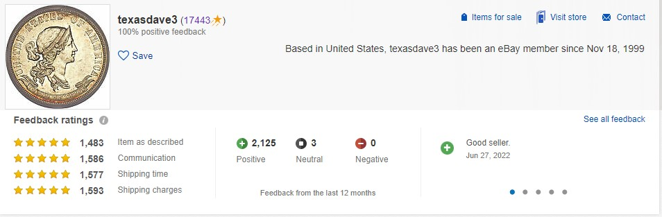
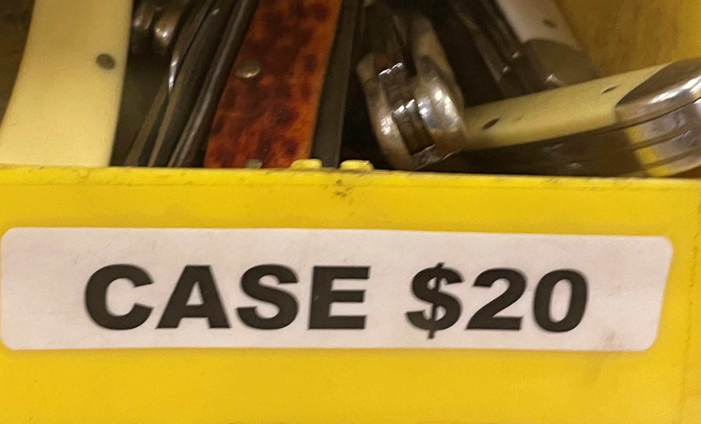
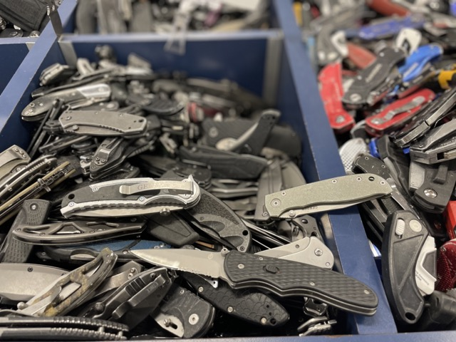

# Predicting Resale Value of Knives from a Texas Government Surplus Store
### Using Machine Learning to Support an Ebay Store's Financial Success

Author: Dylan Dey

## Project Links

Below is the link for the GitHub project page. 

[Github link](https://github.com/ddey117/Neural_Network_Predicting_Reseller_Success_Ebay)

# Predicting Resale Value of Knives from a Texas Government Surplus Store

## Using Machine Learning to Support an Ebay Store's Financial Success

### Data Exploration and Modeling

**Author:** Dylan Dey

# Overview
[Texas State Surplus Store](https://www.tfc.texas.gov/divisions/supportserv/prog/statesurplus/)

[What happens to all those items that get confiscated by the TSA? Some end up in a Texas store.](https://www.wfaa.com/article/news/local/what-happens-to-all-those-items-that-get-confiscated-by-the-tsa-some-end-up-in-a-texas-store/287-ba80dac3-d91a-4b28-952a-0aaf4f69ff95)

[Texas Surplus Store PDF](https://www.tfc.texas.gov/divisions/supportserv/prog/statesurplus/State%20Surplus%20Brochure-one%20bar_rev%201-10-2022.pdf)

[Everything that doesn't make it through Texas airports can be found at one Austin store](https://cbsaustin.com/news/local/everything-that-doesnt-make-it-through-texas-airports-can-be-found-at-one-austin-store)

> The Texas Facilities Commission collects left behind possessions, salvage, and surplus from Texas state agencies such as DPS, TXDOT, TCEQ, and Texas Parks & Wildlife. Examples of commonly available items include vehicles, furniture, office equipment and supplies, small electronics, and heavy equipment. The goal of this project is to create a predictive model in order to determine the resale value of knivse from the Texas State Surplus Store on eBay. 

# Business Problem

[Family Ebay Store Front](https://www.ebay.com/str/texasdave3?mkcid=16&mkevt=1&mkrid=711-127632-2357-0&ssspo=ZW3G27tGR_m&sssrc=3418065&ssuid=&widget_ver=artemis&media=COPY)

[Texas Dave's Knives](https://www.ebay.com/str/texasdave3/Knives/_i.html?store_cat=3393246519)

> While taking online courses to transition careers during a difficult time of my life, I was also helping my family during a turbulent time for everyone. I have been employed at their retail store in San Antonio for the past several months and have been contributing significantly to their online reselling business on eBay. I would help source newer, cheaper products from Austin to try and resell at the retail store in San Antonio or online to earn some money, support our family business. This is how I discovered the <mark>Texas State Surplus Store.</mark> 

> My family has been running a resale shop and selling on Ebay and other sites for years and lately the business has picked up.  Consumer behavior is shifting:  getting a deal on eBay, or Goodwill, or hitting up a vintage boutique shop to find a unique treasure is now brag worthy.  Plus, people like the idea of sustainability - sending items to landfills is becoming very socially unacceptable – why not repurpose a used item?  With the pandemic related disruption of “normal” business and supply chains and the economic uncertainty of these times there is definitely an upswing in interest in the resale market. 

> Online sales sites like Ebay offer a worldwide robust buyer base for just about every product regardless of condition. Ebay  allows the reseller to find both  bargain hunters for common items and  enthusiasts searching for rare  collectible items. 

> An Ebay business has some pain points, however. <mark>Selection of an item to sell</mark> is the main pain point. The item should be readily available in decent condition for the seller to purchase at a low price but not so widely available that the market is saturated with that item.  Then there needs to be a demand for the item – it should be something collectible that with appeal to hobbyists that would pay premium prices for hard-to-get items. Alternatively, it would be something useful to a large number of people even in a used condition. The item should be small enough to be easily shipped. It should not be difficult to ship either—that is it should not have hazardous chemicals, batteries etc. that would add costs to the shipping. Additionally, Ebay has strict rules about authentication and certification in many item categories- so obvious “high value” items like jewelry or designer purses are so restricted that it is not  feasible  for the average Ebay seller to offer them . 

> This project recommends an item that would answer these concerns – pocket knives, These can be rare and collectible and also practical and useful. There are knife collector forums and subReddits, showing there is an interest among collectors.  A look at eBay listings shows rare knives selling for thousands of 
dollars each.  Knives are also a handy every day tool –  and based on the number  showing up in the Texas Surplus shop they are easy to lose and so need replacing often. This means there is a market for more common ones as well.  The great thing about <mark>single blade, modern, factory manufactured pocketknives</mark> is that they all weigh roughly 0.5 lbs making them cheap to ship. For my modeling purposes, it is safe to <mark>assume a flat shipping rate of 4.95(US Dollars)</mark> including the cost of wholesale purchased padded envelopes. And there are no restrictions on mailing these items and they are not fragile so no special packaging is needed. 

> The second pain point is <mark>buying at a cost low enough to make a profit.</mark> It is not enough to just buy low and sell at a higher price as expenses need to be considered.  Ebay collects insertion fees and final value fees on all sales.  The fees vary with seller level (rating)  and some portions  are a percent of final sale. I have been selling knives from the lower priced bins and the mean seller fee for my sales so far is about 13.5% of the sold price.  So that is a cost to consider right up front. 

> A third pain point is <mark>the cost of excess inventory.</mark> A seller can obtain quality items at a reasonable cost and then the inventory may sit with no sales, meaning the capital expended is sitting tied up in unwanted items. This inventory carry cost is a drain on profitability.  This project is meant to help avoid purchasing the wrong items for resale. 

> As already mentioned, I have been experimenting with low cost used knives for resale but have not risked a large capital investment in the higher end items. The goal of this project is to attempt to address the pain points to determine if a larger investment would pay off. Can I identify which knives are worth investing in so that I can turn a decent profit and hopefully avoid excess inventory? A data driven approach would help avoid costly mistakes from the "system" resellers currently employ, which seems to be mainly a gambler’s approach. By managing resources upfront through a model, I can effectively increase my return on investment with messy data such as pictures and titles. The magic of Neural Networks!

> There are <mark>eight buckets</mark> of presorted brand knives that I was interested in, specifically. These bins are behind glass, presorted, branded(and therefore have specific characteristics and logos for my model to identify), and priced higher. However, the staff has a very large amount of confiscated items flowing into the facility to list for resale, and when that happens they will not have time to preset them and they end up in huge buckets of unsorted knives for people to dig through. The brands will be priced the same, they are just no longer sorted and harder to find. This particular scenario is where a NN could really shine to help add more inventory to our Ebay website without risking more money or spending extra time than simply digging through the presorted bins everytime. Expanding the bins to pull inventory from will increase the chance of finding inventory worth reselling. 

**sorted bucket example**

**overflow example**

The Eight Pocketknife brands and their associated cost at the Texas Surplus Store:
<ul>
  <li>Benchmade: \$45.00</li>
  <li>Buck: \$20.00</li>
  <li>Case/Casexx: \$20.00</li>
  <li>CRKT: \$15.00</li>
  <li>Kershaw: \$15.00</li>
  <li>SOG: \$15.00</li>
  <li>Spyderco: \$30.00</li>
  <li>Victorinox: \$20.00</li>
</ul>

[Ebay Developer Website](https://developer.ebay.com/)
> Ebay has a website for developers to create an account and register an application keyset in order to make API call requests to their live website. By making a findItemsAdvanced call to the eBay Finding APIVersion 1.13.0, I was able to get a large dataset of [category_id=<48818>](https://www.ebay.com/sch/48818/i.html?_from=R40&_nkw=knife) knives listed for sale. This data is limited to anything listed within the past 90 days from when the API call was made.

> When you log into Ebay as a buyer and search knife in the search bar, the response that loads outputs  Knives, Swords & Blades. Nested one category furtheris Collectible Folding Knives with an id of 182981. Nested one further is Modern Folding Knives(43333), and then finally, the category_id of most interest, 48818, Factory Manufactured Modern Collectible Folding Knives. 

> The eBay Finding APIVersion 1.13.0 [findItemsAdvanced](https://developer.ebay.com/devzone/finding/callref/finditemsadvanced.html) call returns a lot of usefull information about listings, including itemId(a unique identifier for ebay listings),price, shipping price, area code, the title of the listing, the url for the listing, whether the seller set autoPay for the listing or whether the seller is a top rated seller or not, the condition of the item being sold, whether the seller accepts returns, and various links to images of the item being sold at different resolutions. If you look at a typical eBay listing, however, there is usually more minute information available that is required to be filled out by the seller upon posting the listing. To get this information, another API must be used that accepts the itemId of listings to return more details.

> The eBay Shopping APIVersion 1247 [GetMultipleItems](https://developer.ebay.com/Devzone/shopping/docs/CallRef/GetMultipleItems.html) call accepts itemIds and returns seller authored details on the item for sale in their listing. This was used to get information such as of the model or product line for the knife being listed, blade material, blade type, blade edge type, color, the number of blades, opening mechanism, handle material, lock type, and blade range.

> All of the data gathered from eBay's public API is limited to listed data posted in the past 90 days and doesn't include a "sold" price. Sold data is locked behind eBay's proprietary webapp, known as Terapeak. Data on this pay to play webapp has an option for sold data that goes back 2 years! Therefore, gaining access to this webapp and scraping all relevant pages proved to be very valuable and bypasses the limits of the free API. I used my reletavely new eBay seller's account to sign up for a free trial of terapeak and scraped useful data for sold, used knives of the 8 relevant brands. Information scraped includes Images, titles, price sold, shipping cost. 

>A majority of the data was scraped from eBays proprietary Terapeak webapp, as this data goes back 2 years as compared to the API listed data that only goes back 90 days. It is assumed a large enough amount of listed data should approximate sold data well enough to prove useful for this project. 

> The target feature for the model to predict is the total price (shipping included) that a knife should be listed on eBay. One model will be using titles and images in order to find potential listings that are undervalued and could be worth investing in. Another model will accept only images as input, as this is an input that can easily be obtained in person at the store. This model will use past sold data of knives on eBay in order to determine within an acceptable amount of error the price it will resale for on eBay (shipping included) using only an image.

  
After cleaning the data to remove lots, groups, and most of the listings with multiple knives using regex, there were over 70,000 listings scraped from Terapeak, represting the final sale price of 70K different knives and their associated titles and images.
round 10K listings were obtained using eBay's API, represnting current listed knives and their asking price. A large enough sample size of knives currently listed for sale should approximate the true value of the knife. A lot more of the sold data was available and is a clear indicator of the value of knives over the past two years.
 

 
 

  
After combining the two datasets mentioned above, the data was then filtered to remove outliers using IQR filtering. The final dataset includes roughly 76K listings for knives between the 8 brands of interest.
 

